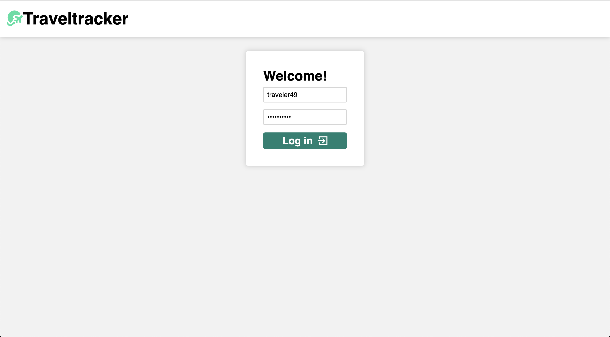
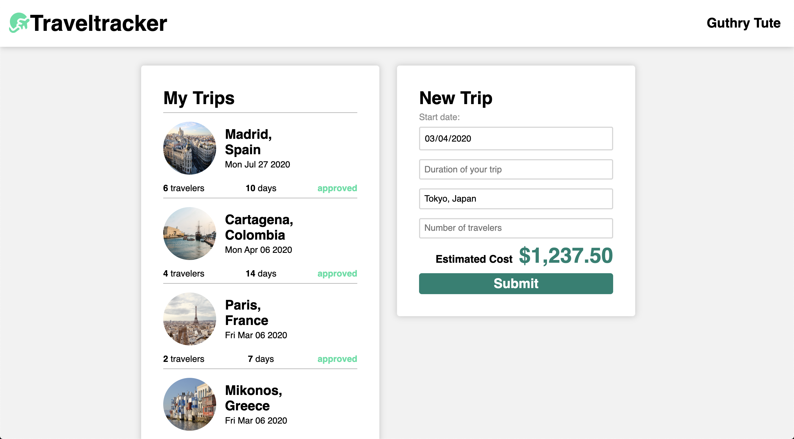
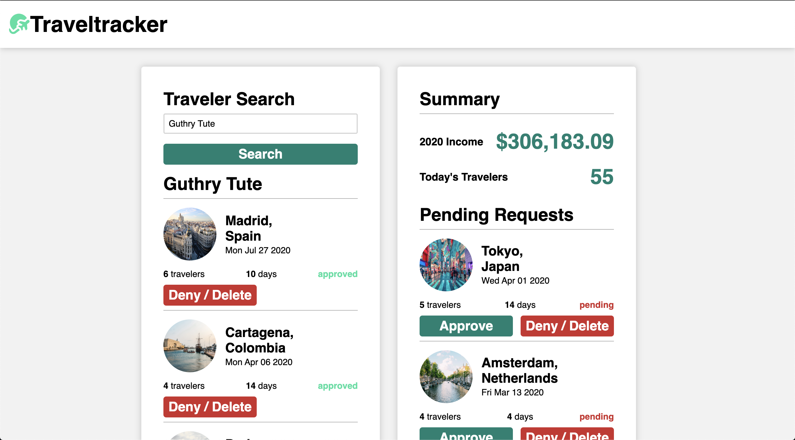

# Travel Tracker
by Jonathan Tschida
## Overview

This was a project assigned during Mod 2 at Turing.  We were tasked with creating a web application for a travel agency.  Users would be presented with a log in screen where they could log in as a traveler or an agent.  The travelers needed to be able to view all their trips and how much they had spent on trips this year, as well as be able to plan new trips.  Agents needed to be be able to see all the pending trips and be able to approve or deny them.  Agents also needed the ability to search for a traveler and view all of their trips as well as interact with them.

The goal of this project was to demonstrate our skill with the following:
 - Object Oriented Programming
 - Network requests (via the fetch API)
 - Good UI/UX design
 - Testing (using Mocha/Chai)
 - DOM manipulation with jQuery
 - SCSS

## Screenshots

## Set Up

If you want to view the project, it is deployed to [github pages.](https://jonathan-tschida.github.io/travel-tracker/)

If that is not working for some reason, or you would like to run the project on your own machine, follow these steps:

1. clone down the repo using `git clone`
2. run `npm install`
3. run `npm start` to host a local server
4. navigate to [http://localhost:8080/](http://localhost:8080/) in your browser to view it.
5. You can log in with either 'traveler' plus a number between 1 and 50, or just 'agency'.  All users have a password of 'travel2020'
